# Message Bus Abstraction Design

## Status

**Planned** (Planning document retained for reference and project history)

---

## Authority Notice

The Aiel codebase (contracts, implementations, and tests) is the authoritative specification for work in progress. This document describes the intended package boundaries, contract shape, and implementation sequence for transport-backed message bus integration. As this feature is implemented, refer to the contracts in `src/` and the tests in `tests/` as the definitive current behavior.

---

## Problem Statement

Aiel already has explicit in-process coordination mechanisms:

- command and query dispatch through the application layer
- in-process fan-out notifications through `Aiel.Mediator` (`IPublisher` / `INotification`)
- domain-event dispatch through `IDomainEventDispatcher`

What Aiel does not yet have is an explicit abstraction for **inter-process messaging**.

Applications that need to integrate with a broker today would go straight to transport libraries such as Rebus or MassTransit. If that happens without a framework-owned boundary, several problems appear immediately:

- transport-specific concepts leak into application code
- correlation, causation, actor, tenant, and message identifiers become ad hoc header conventions
- domain events are at risk of being published directly to the broker instead of being translated into explicit integration messages
- the outbox direction already implied by `IDomainEventDispatcher` becomes harder to adopt cleanly
- applications drift toward string-based routing, header names, and serializer conventions that Aiel cannot validate or reason about

Aiel should solve this by owning a **narrow abstraction layer** for transport-backed messaging. That abstraction should define the contracts, metadata model, and registration seams that application code depends on, while leaving transport runtime behavior to separate adapter packages or to the consuming application.

Aiel is greenfield. This feature should therefore choose the clean boundary now:

- no compatibility shims
- no hidden runtime bridging
- no full broker SDK clone
- no silent fallback implementation
- no ambiguity between in-process messaging and transport-backed messaging

---

## Non-Goals

This feature does **not** make Aiel a message broker framework.

The following are out of scope for the abstraction layer:

- a built-in broker client or default transport runtime
- queue or topic provisioning
- retry policy orchestration
- dead-letter management
- delayed or scheduled delivery
- saga orchestration
- request-response or RPC abstractions
- endpoint addressing as a first-class application concept
- automatic publication of domain events to a broker
- automatic promotion of mediator notifications to transport messages
- transport-specific topology, subscriptions, routing slips, or dashboard features
- ambient static state or hidden runtime interception

If an application needs those features, they should come from the chosen transport library or from transport-specific adapter code, not from the Aiel core abstraction.

---

## What Is Being Developed

### Message bus contract boundary

Introduce a dedicated package for transport-backed message bus contracts. The package should own:

- the marker contract for transportable integration messages
- strongly typed message envelopes and metadata
- the publisher contract
- the consumer handler contract
- inbound transport context
- serializer and message-type registry contracts where they are needed to support outbox and adapter implementations
- explicit DI registration seams for the abstraction itself

### Testing support

Introduce a small testing package with fakes and recorders so application code can test message publication and message consumption without booting a real broker.

### Explicit boundary between three messaging concepts

This feature must make the following distinction unavoidable:

1. `Aiel.Mediator` notifications are **in-process only**
2. `IDomainEventDispatcher` is **internal domain/application coordination**
3. the message bus abstraction is **transport-backed inter-process messaging**

The abstraction is successful only if application developers can tell which one they are using by looking at the type names and the injected contracts.

---

## Package Family

| Package | Purpose |
| --- | --- |
| `Aiel.MessageBus.Abstractions` | Core contracts: integration messages, envelopes, metadata, publisher, handler, serializer, and type registry |
| `Aiel.MessageBus.Testing` | Test doubles, recording publishers, deterministic fake transport contexts, and assertion helpers |

Transport adapter packages (for Rebus, MassTransit, or other transports) live in separate packages or in the consuming application and are intentionally outside the core abstraction family.

### Package ownership guidance

`Aiel.MessageBus.Abstractions` should be small and dependency-light. It may depend on:

- `Aiel.Application.Contracts` for `IExecutionContext`
- `Aiel.MultiTenancy` for `TenantIdentity` — note that `TenantIdentity` is still stabilizing; this dependency should be reviewed as that contract matures

It should **not** depend on:

- `Aiel.Application`
- `Aiel.Domain`
- `Aiel.EntityFrameworkCore`
- any transport SDK
- any hosted-service runtime assumptions

The testing package may depend on the abstraction package and on lightweight testing helpers only.

---

## Core Contracts

### Recommended contract shape

The abstraction should standardize a small set of contracts. The following shape is intentionally narrow and explicit.

```csharp
namespace Aiel.MessageBus;

public interface IIntegrationMessage;

/// <summary>
/// Overrides the <see cref="MessageTypeName"/> that <see cref="IMessageTypeRegistry"/> derives
/// from the CLR type name. Apply to any <see cref="IIntegrationMessage"/> implementation to use
/// a stable, broker-friendly name instead of the fully qualified CLR type name.
/// </summary>
[AttributeUsage(AttributeTargets.Class | AttributeTargets.Struct, Inherited = false)]
public sealed class MessageTypeAttribute(string name) : Attribute
{
    public string Name { get; } = name;
}

public readonly record struct MessageTypeName(string Value);
public readonly record struct MessagePropertyName(string Value);
public readonly record struct ActorKind(string Value);
public readonly record struct ActorIdentifier(string Value);

public sealed record MessageActorSnapshot(
    ActorKind Kind,
    ActorIdentifier Identifier);

public sealed record MessageMetadata(
    Guid MessageId,
    Guid CorrelationId,
    Guid? CausationMessageId,
    Guid? ProducerOperationId,
    Guid? ClientInstanceId,
    MessageActorSnapshot Actor,
    TenantIdentity? Tenant,
    DateTimeOffset OccurredAtUtc,
    IReadOnlyDictionary<MessagePropertyName, string> Properties);

public sealed record MessageEnvelope<TMessage>(
    MessageTypeName MessageType,
    TMessage Message,
    MessageMetadata Metadata)
    where TMessage : IIntegrationMessage;

public sealed record TransportContext(
    string TransportName,
    string? NativeMessageId,
    int DeliveryAttempt);

public sealed record InboundMessageContext<TMessage>(
    MessageEnvelope<TMessage> Envelope,
    IExecutionContext ExecutionContext,
    TransportContext Transport)
    where TMessage : IIntegrationMessage;

public interface IMessageEnvelopeFactory
{
    MessageEnvelope<TMessage> Create<TMessage>(
        TMessage message,
        IExecutionContext executionContext,
        TenantIdentity? tenant = null)
        where TMessage : IIntegrationMessage;
}

public interface IMessagePublisher
{
    /// <summary>
    /// Publishes a pre-built envelope through the configured transport adapter.
    /// Use this overload when you need to inspect or mutate metadata before publication.
    /// </summary>
    ValueTask PublishAsync<TMessage>(
        MessageEnvelope<TMessage> envelope,
        CancellationToken cancellationToken = default)
        where TMessage : IIntegrationMessage;

    /// <summary>
    /// Convenience overload. Creates an envelope via the registered
    /// <see cref="IMessageEnvelopeFactory"/> and publishes it.
    /// </summary>
    ValueTask PublishAsync<TMessage>(
        TMessage message,
        IExecutionContext executionContext,
        TenantIdentity? tenant = null,
        CancellationToken cancellationToken = default)
        where TMessage : IIntegrationMessage;
}

public interface IMessageHandler<TMessage>
{
    ValueTask HandleAsync(
        InboundMessageContext<TMessage> context,
        CancellationToken cancellationToken = default)
        where TMessage : IIntegrationMessage;
}

public sealed record SerializedMessage(
    MessageTypeName MessageType,
    ReadOnlyMemory<byte> Body,
    MessageMetadata Metadata);

public interface IMessageSerializer
{
    SerializedMessage Serialize<TMessage>(MessageEnvelope<TMessage> envelope)
        where TMessage : IIntegrationMessage;

    MessageEnvelope<TMessage> Deserialize<TMessage>(SerializedMessage message)
        where TMessage : IIntegrationMessage;
}

public interface IMessageTypeRegistry
{
    /// <summary>
    /// Returns the stable <see cref="MessageTypeName"/> for <typeparamref name="TMessage"/>.
    /// Defaults to the fully qualified CLR type name (<c>Namespace.ClassName</c>).
    /// Apply <see cref="MessageTypeAttribute"/> to the message type to override with a
    /// stable, broker-friendly name.
    /// </summary>
    MessageTypeName GetName<TMessage>()
        where TMessage : IIntegrationMessage;

    Type Resolve(MessageTypeName messageTypeName);
}
```

### Why this shape fits Aiel

- `IIntegrationMessage` makes the cross-process boundary explicit. Arbitrary objects, mediator notifications, and domain events are not implicitly bus messages.
- `MessageEnvelope<TMessage>` separates payload from metadata and keeps the message strongly typed.
- `MessageMetadata` gives first-class names to correlation, causation, actor, tenant, and message identifiers instead of hiding them in transport headers.
- `InboundMessageContext<TMessage>` cleanly distinguishes transport delivery details from the reconstructed local execution context.
- `IMessageEnvelopeFactory` centralizes metadata creation so applications do not duplicate propagation logic.
- `IMessagePublisher` exposes both an envelope overload (for callers that need to inspect or mutate metadata) and a convenience overload that accepts a raw message and delegates envelope creation to `IMessageEnvelopeFactory`.
- `[MessageType("stable-name")]` on a message type overrides the default `MessageTypeName`, which is derived from the fully qualified CLR type name. The default requires no ceremony; the attribute provides a stable, broker-friendly name when the CLR name is not suitable.
- `SerializedMessage.Body` is `ReadOnlyMemory<byte>` rather than `byte[]` to avoid unnecessary copies in adapters that work with pooled buffers or memory-mapped transport payloads.
- `IMessageSerializer` and `IMessageTypeRegistry` are sufficient to support adapters and a future outbox without baking a wire format into the application layer.

### Existing `MessageContext<TMessage>`

`MessageContext<TMessage>` already exists in `Aiel.Application.Contracts` and previous planning notes reserve it for messaging and outbox work.

That direction is sound, but the current name is too vague once the feature becomes real. This design recommends replacing it with two more explicit concepts:

- `MessageEnvelope<TMessage>` for the payload plus metadata
- `InboundMessageContext<TMessage>` for a consumed message plus local execution and transport details

That naming makes the boundary more obvious and prevents confusion with domain-event or mediator handler signatures.

---

## Delivery Model

The abstraction should standardize a simple delivery model.

### Supported model

- one-way, asynchronous, transport-backed delivery
- immutable message contracts
- publish and consume
- at-least-once delivery assumptions
- explicit context propagation
- explicit serialization boundary

### Unsupported model

- transparent in-process fallback
- hidden retries
- synchronous request-response
- endpoint addressing as a framework-level concern
- exactly-once guarantees
- global ordering guarantees

### Consequences

Applications and handlers must assume:

- a published message may be delivered more than once
- consumer handlers must be idempotent
- transport ordering, if any, is transport-specific and not guaranteed by Aiel
- publication may mean immediate transport handoff **or** durable staging for later outbox delivery

`IMessagePublisher.PublishAsync` should therefore be understood as:

> "Aiel has accepted this message for transport-backed delivery through the configured integration path."

It should **not** be interpreted as a guarantee that the broker has already persisted or delivered the message to consumers.

---

## Relationship to Mediator and Domain Events

The framework must document these boundaries explicitly.

| Concern | Contract | Scope | Serialization | Cross-process | Primary purpose |
| --- | --- | --- | --- | --- | --- |
| Mediator notifications | `IPublisher` / `INotification` | in-process | no | no | fan-out inside the current process |
| Domain-event dispatch | `IDomainEventDispatcher` | internal application/domain coordination | not in the default implementation | not directly | react to aggregate-raised domain events |
| Message bus integration | `IMessagePublisher` / `IMessageHandler<TMessage>` | inter-process | yes | yes | integration messaging between processes or services |

### 1. In-process mediator notifications

`Aiel.Mediator` notifications are not transport messages.

They:

- run in the current process
- do not cross a serialization boundary
- do not require broker metadata
- do not imply retries, queues, or durable delivery

Aiel should not automatically bridge `INotification` to the message bus abstraction.

If a developer wants a notification to cause an integration message, that must happen through explicit application code.

### 2. Domain-event dispatch

`IDomainEventDispatcher` remains the mechanism for dispatching domain events raised by aggregates.

Its current contract already states that the default implementation may later be replaced by an outbox-backed implementation. The message bus abstraction must align with that, not compete with it.

That means:

- domain events remain domain events
- domain-event handlers remain internal handlers
- the dispatcher contract is not replaced with a bus publisher contract
- selected domain-event handlers may map domain events to `IIntegrationMessage` instances

A domain event is an internal fact about the domain model. An integration message is an explicit cross-process contract. They are related, but they are not the same thing.

### 3. Transport-backed message bus integration

The message bus abstraction is the boundary for data leaving or entering the process through a broker-backed transport.

Typical flow:

- a domain event occurs
- an application-level handler decides that an external integration message should be emitted
- a `MessageEnvelope<TMessage>` is created from the current execution and tenant context
- the envelope is staged through an outbox or published through the configured transport adapter
- a consumer app receives the message and invokes `IMessageHandler<TMessage>`
- that handler calls application services, dispatches commands, or otherwise enters the normal application boundary

The transport-backed message bus is therefore an **integration edge**, not a second mediator.

---

## Tenant and Execution-Context Propagation

This area must be explicit and strongly typed.

### Required metadata

Every published transport message should carry:

- `MessageId`
- `CorrelationId`
- `CausationMessageId` when the current publish is caused by a previously consumed message
- `ProducerOperationId` when the publish originates from local application execution
- `ClientInstanceId` when known
- actor snapshot
- tenant identity when known
- timestamp
- optional typed extension properties

### Why tenant propagation cannot be implicit

`IExecutionContext` currently carries:

- `OperationId`
- `CorrelationId`
- `CausationId`
- `ClientInstanceId`
- `Actor`
- `Properties`

It does **not** currently expose a first-class tenant property.

Aiel already has explicit tenant contracts in `Aiel.MultiTenancy`, including `TenantIdentity` and `ITenantAccessor`. The message bus abstraction should therefore carry tenant identity as a first-class field on `MessageMetadata`, rather than burying it in raw headers.

### Actor propagation

`IActor` is intentionally minimal and process-local. It is not a wire contract. Its current shape includes a `StrongId` identifier whose string representation is not defined at the `IActor` contract level.

The message bus abstraction must therefore use a transport-safe snapshot such as `MessageActorSnapshot` rather than attempt to serialize arbitrary `IActor` implementations. `ActorIdentifier` uses a plain `string` rather than a `StrongId` so that message metadata remains transport-safe and does not import `Aiel.StrongIds` into `Aiel.MessageBus.Abstractions` or expose Aiel-specific identifier types to consuming processes.

When creating a `MessageActorSnapshot`, application code is responsible for converting the actor's `StrongId` to its canonical string representation.

This preserves the distinction between:

- local execution actor representations
- transport-safe actor identity metadata

### Consumption-side reconstruction

When a message is consumed:

- a new local `IExecutionContext` should be created
- that context gets a fresh local `OperationId`
- its `CorrelationId` should come from the inbound message metadata
- its `CausationId` should be the inbound `MessageId`
- its `ClientInstanceId` should be copied when present
- its actor should be reconstructed from message metadata according to application rules
- tenant identity should be made available to tenant resolution or binding infrastructure in an explicit way

Until `IExecutionContext` grows a first-class tenant field, tenant propagation into local execution should be done through framework-owned integration points or well-known constants, not through ad hoc string keys invented per application.

---

## Recommended Outbox Direction

The message bus abstraction should be designed so that an outbox can be added without changing application-facing contracts.

### Recommended flow

```mermaid
flowchart LR
    A[Application Service or Command Handler] --> B[Aggregate raises domain event]
    B --> C[IDomainEventDispatcher]
    C --> D[Domain event handler maps to IIntegrationMessage]
    D --> E[Create MessageEnvelope from execution + tenant context]
    E --> F[Persist serialized envelope in outbox]
    F --> G[Outbox dispatcher]
    G --> H[Transport adapter]
    H --> I[Broker]
    I --> J[Consumer app transport adapter]
    J --> K[IMessageHandler<TMessage>]
    K --> L[Application boundary]
```



### Recommended responsibilities

The future outbox should do the following:

- persist `SerializedMessage` plus enough dispatch state to retry safely
- preserve the exact `MessageMetadata` created at publish time
- use `IMessageTypeRegistry` for stable message-type identity
- use `IMessageSerializer` for deterministic body serialization
- keep transport concerns out of domain-event contracts
- allow a future outbox-backed `IDomainEventDispatcher` implementation to remain compatible with existing domain-event handlers

### Important boundary rule

The outbox should be the place where transport durability is introduced.

It should **not** force applications to replace domain-event handlers with message-bus handlers, and it should **not** require domain events to become transport messages.

The message bus abstraction succeeds here if a future outbox can be inserted by changing infrastructure wiring rather than by rewriting application code.

---

## Registration and Dependency Model

### Core registration

`Aiel.MessageBus.Abstractions` exposes a `MessageBusAbstractionsDependency : AielDependency` subclass as the primary registration entry point for Aiel applications. Applications declare it through `[DependsOn]` in their module graph:

```csharp
[DependsOn(typeof(MessageBusAbstractionsDependency))]
public sealed class MyApplication : AielApplication { ... }
```

`MessageBusAbstractionsDependency` registers only framework-owned support services:

- `IMessageEnvelopeFactory`
- `IMessageTypeRegistry`
- any strongly typed option objects needed by the abstraction

It should **not** register a fake or no-op `IMessagePublisher`.

If no transport adapter is registered, resolving `IMessagePublisher` should fail clearly during composition.

### Handler registration

If handler scanning is supported, it should be:

- opt-in
- bounded to explicitly supplied assemblies
- limited to `IMessageHandler<TMessage>` implementations

Aiel should not perform broad ambient scanning of all loaded assemblies.

### Adapter registration

Transport adapters should live in separate packages or in the consumer app and expose their own `AielDependency` subclass that depends on `MessageBusAbstractionsDependency`:

```csharp
[DependsOn(typeof(MessageBusAbstractionsDependency))]
public sealed class RebusMessageBusDependency : AielDependency { ... }
```

Adapter-specific service-collection extension methods (such as `AddAielRebusMessageBus(...)`) may still be useful for configuration, but the `AielDependency` subclass is the module-graph entry point that makes the transport wiring explicit.

Adapter registrations are responsible for:

- binding `IMessagePublisher`
- binding or choosing `IMessageSerializer`
- mapping `MessageMetadata` to native transport headers
- receiving native messages and translating them into `InboundMessageContext<TMessage>`
- hosted service or transport lifecycle integration, if required

### Dependency direction

The dependency direction should remain explicit:

- application code depends on `Aiel.MessageBus.Abstractions`
- adapter packages depend on `Aiel.MessageBus.Abstractions` and the transport SDK
- domain code does not depend on transport adapters
- `Aiel.MessageBus.Abstractions` does not depend on application runtime packages

---

## Decisions

### D1 - Aiel owns the message bus contract boundary, not the transport runtime

**Decision:** Aiel will provide an abstraction package for transport-backed messaging, but it will not provide a full broker implementation.

**Rationale:** This gives applications a stable, framework-owned contract surface without forcing Aiel to recreate Rebus, MassTransit, or another broker SDK.

---

### D2 - Transport-backed messages are explicit integration messages

**Decision:** only types implementing `IIntegrationMessage` are publishable through the message bus abstraction.

**Rationale:** This prevents accidental publication of domain events, mediator notifications, commands, or anonymous objects. It keeps the inter-process boundary obvious in code.

---

### D3 - Envelope and metadata are first-class contracts

**Decision:** publication and consumption center on `MessageEnvelope<TMessage>` and `MessageMetadata`, not on payload-only APIs plus hidden header conventions.

**Rationale:** Aiel prefers explicitness over magic. Correlation, causation, actor, tenant identity, and message identifiers should be visible in typed contracts.

---

### D4 - Actor and tenant propagation are explicit and transport-safe

**Decision:** the abstraction uses a transport-safe actor snapshot and `TenantIdentity` metadata rather than trying to serialize `IActor` or infer tenant information from raw transport headers.

**Rationale:** `IActor` is deliberately process-local, and `IExecutionContext` does not currently expose tenant identity directly. The bus contract must therefore carry those concerns explicitly.

---

### D5 - The abstraction aligns to an outbox-first future

**Decision:** the contract surface must support a future outbox-backed publication path without changing application-facing publish or handler contracts.

**Rationale:** `IDomainEventDispatcher` already states that its implementation may be replaced by an outbox-backed version. The message bus feature should reinforce that direction.

---

### D6 - Aiel will not standardize broker-specific features

**Decision:** Aiel will not put retries, scheduling, endpoint addressing, subscriptions, sagas, or topology APIs into the core abstraction.

**Rationale:** Those features are transport-specific, and standardizing them at the Aiel level would either leak broker semantics or force Aiel to invent low-value abstractions.

---

### D7 - No silent no-op publisher

**Decision:** Aiel will not register a fake transport publisher in production composition by default.

**Rationale:** Silent success is hidden runtime behavior. If an application depends on transport-backed messaging and no adapter is registered, startup or composition should fail clearly.

---

### D8 - `MessageContext<TMessage>` should become more explicit

**Decision:** replace the vague `MessageContext<TMessage>` concept with explicit `MessageEnvelope<TMessage>` and `InboundMessageContext<TMessage>` contracts.

**Rationale:** The reserved direction for messaging/outbox work is correct, but the real feature needs names that make outbound and inbound responsibilities obvious.

---

### D9 - The abstractions package participates in the module graph

**Decision:** `Aiel.MessageBus.Abstractions` exposes a `MessageBusAbstractionsDependency : AielDependency` subclass. Transport adapters expose their own `AielDependency` subclass that depends on it through `[DependsOn]`.

**Rationale:** Consistent with every other Aiel package. The module graph makes the transport wiring visible at compile time through the source-generated dependency graph and gives the analyzer visibility into the dependency chain. Declaring a transport adapter in `[DependsOn]` is unambiguous; calling a manual registration method is not.

---

### D10 - `MessageTypeName` defaults to the CLR type name, overridable by attribute

**Decision:** `IMessageTypeRegistry.GetName<TMessage>()` returns a `MessageTypeName` derived from the fully qualified CLR type name (`Namespace.ClassName`) by default. Applying `[MessageType("stable-name")]` to the message type overrides that default.

**Rationale:** The CLR name works without any ceremony for most cases. The attribute escape hatch lets teams use stable, broker-friendly names (such as lowercase dot-separated or kebab-case event names) without renaming the CLR type or adding convention logic to the registry.

---

## Completion Criteria

This feature is complete when all of the following are true:

- [ ] `Aiel.MessageBus.Abstractions` exists and contains only transport-agnostic contracts
- [ ] `IIntegrationMessage` exists and is the only publishable message contract
- [ ] `MessageEnvelope<TMessage>` and `MessageMetadata` exist with first-class support for message ID, correlation, causation, actor, tenant identity, and client instance
- [ ] inbound consumption uses an explicit context type that separates envelope, execution context, and transport delivery data
- [ ] `IMessagePublisher` and `IMessageHandler<TMessage>` exist
- [ ] serializer and message-type registry contracts exist, or an equally explicit alternative is adopted and documented
- [ ] `IMessageTypeRegistry` defaults to the CLR type name and is overridable by `[MessageType]` attribute on the message type
- [ ] `IMessagePublisher` exposes a convenience overload that accepts a raw message and delegates envelope creation to the registered `IMessageEnvelopeFactory`
- [ ] `Aiel.MessageBus.Abstractions` exposes a `MessageBusAbstractionsDependency : AielDependency` subclass that applications declare in `[DependsOn]`
- [ ] no broker SDK dependency is introduced into the abstraction package
- [ ] `MessageContext<TMessage>` ownership is clarified and the final naming is explicit
- [ ] a testing package exists with at least a recording publisher and fake inbound context helpers
- [ ] the documentation explicitly distinguishes mediator notifications, domain-event dispatch, and transport-backed message bus integration
- [ ] the design supports an outbox-backed future without changing domain-event contracts
- [ ] no Aiel core package introduces a silent no-op transport implementation
- [ ] all new projects are added to the solution files, folder maps, and central package configuration where required
- [ ] unit tests cover metadata creation, context reconstruction, and failure behavior for missing transport registration
- [ ] solution build remains clean

---

## Implementation Plan

Tasks execute in this order to keep the contract boundary clear before any transport adapter exists.

### Task 0 - Verify design inputs

**Files:**

- `docs/ConceptualOverview.md`
- `src/Aiel.Application.Contracts/Aiel/Domain/IDomainEventDispatcher.cs`
- `src/Aiel.Application/Aiel/Domain/DefaultDomainEventDispatcher.cs`
- `src/Aiel.Application.Contracts/Aiel/Messaging/MessageContext.cs`

Confirm the following design inputs remain true:

- Aiel prefers explicitness over hidden magic
- `IDomainEventDispatcher` remains replaceable by an outbox-backed implementation
- `MessageContext<TMessage>` remains reserved for messaging/outbox work, not domain-event handler signatures

No production code changes in this task.

### Task 1 - Add the abstraction package

**Projects:**

- add `src/Aiel.MessageBus.Abstractions/Aiel.MessageBus.Abstractions.csproj`
- add `tests/Aiel.MessageBus.UnitTests/Aiel.MessageBus.UnitTests.csproj`

**Initial contents:**

- `IIntegrationMessage`
- `MessageTypeName`
- `MessageActorSnapshot`
- `MessageMetadata`
- `MessageEnvelope<TMessage>`
- `TransportContext`
- `InboundMessageContext<TMessage>`

**Test gate:**

- metadata invariants reject empty message and correlation identifiers
- envelope creation is deterministic for the same inputs other than newly generated message ID and timestamp
- no broker SDK reference appears in the project

### Task 2 - Define metadata creation and type identity

**Contracts:**

- `IMessageEnvelopeFactory`
- `IMessageTypeRegistry`
- `MessageTypeAttribute`
- any value objects needed for typed metadata keys or actor identity

**Test gate:**

- envelope factory copies correlation and client instance from `IExecutionContext`
- envelope factory captures producer operation ID
- envelope factory accepts optional tenant identity explicitly
- type registry maps message types without relying on ad hoc assembly-qualified strings in application code
- `[MessageType]` attribute overrides the default CLR-derived name in the registry

### Task 3 - Define publish and consume contracts

**Contracts:**

- `IMessagePublisher`
- `IMessageHandler<TMessage>`

**Rules:**

- only `IIntegrationMessage` types are allowed
- inbound consumption uses `InboundMessageContext<TMessage>`
- transport context remains read-only and observational
- `IMessagePublisher` exposes a convenience overload that delegates envelope creation to `IMessageEnvelopeFactory`

**Test gate:**

- application code can publish and handle messages without referencing a transport package
- inbound context reconstruction creates a fresh local execution operation with the inbound message ID as causation

### Task 4 - Define serialization contracts

**Contracts:**

- `SerializedMessage`
- `IMessageSerializer`

**Test gate:**

- serialized form preserves metadata exactly
- deserialization recreates the strongly typed envelope
- message type identity resolution is deterministic and explicit

### Task 5 - Add testing support

**Projects:**

- add `src/Aiel.MessageBus.Testing/Aiel.MessageBus.Testing.csproj`
- add `tests/Aiel.MessageBus.Testing.UnitTests/Aiel.MessageBus.Testing.UnitTests.csproj`

**Initial helpers:**

- recording publisher
- fake envelope factory or deterministic clock helper
- inbound context builder for tests
- assertion helpers for metadata propagation

**Test gate:**

- application-service tests can assert published messages without a broker
- fake helpers do not require DI container startup

### Task 6 - Add core registration and failing composition tests

**Contracts and helpers:**

- `MessageBusAbstractionsDependency : AielDependency` — the primary module-graph registration entry point for Aiel applications
- service-collection extension used internally by the dependency (and available for direct-registration scenarios outside the module system)
- explicit composition tests showing that `IMessagePublisher` is unresolved until an adapter registers it

**Test gate:**

- no no-op publisher exists
- startup fails clearly when application code depends on transport messaging and no adapter is configured

### Task 7 - Document adapter authoring expectations

**Documentation outputs:**

- adapter responsibilities
- metadata-to-header mapping rules
- execution-context reconstruction rules
- tenant propagation rules
- idempotency expectations for handlers

This task should include Rebus and MassTransit examples in documentation only. It should not force transport implementations into the core package.

### Task 8 - Plan outbox integration as a separate follow-on slice

**Goal:**

- define how a future outbox stores `SerializedMessage`
- define how domain-event handlers create integration messages
- define how an outbox dispatcher uses the transport adapter

**Important constraint:**

This follow-on must not change `IDomainEventDispatcher` or require application code to stop using domain-event handlers.

---

## Final Recommendation

Aiel should implement a **narrow, explicit, transport-agnostic message bus abstraction** with strong typing around envelopes, metadata, and handlers. It should not implement a full broker runtime. It should preserve a hard distinction between:

- in-process mediator notifications
- internal domain-event dispatch
- transport-backed inter-process integration messaging

That design is the smallest one that still gives Aiel real architectural value:

- application code can depend on stable contracts
- transport choice stays open
- metadata propagation becomes explicit and testable
- the future outbox direction remains compatible with existing domain-event contracts
