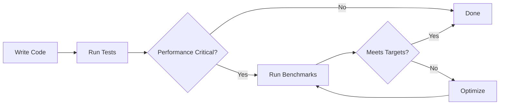

# Aiel.Gps Benchmark Project Summary

## What You've Got

A complete, production-ready benchmarking suite for the GPS library using BenchmarkDotNet, the industry-standard .NET performance measurement framework.

## Project Structure

```
tests/Aiel.Gps.Benchmarks/
├── Aiel.Gps.Benchmarks.csproj   # Project file
├── README.md                          # Comprehensive benchmarking guide
├── QUICKSTART.md                      # Get started in 5 minutes
└── Aiel/Gps/Benchmarks/
    ├── Program.cs                            # Entry point
    ├── GpsBenchmarkBase.cs                   # Base class with test data
    ├── ParsingThroughputBenchmarks.cs        # End-to-end performance tests
    ├── ParserConfigurationBenchmarks.cs      # Parser registration overhead tests
    └── IndividualParserBenchmarks.cs         # Per-message-type performance tests
```

## The Three Benchmark Classes

### 1. ParsingThroughputBenchmarks
**What it measures**: How fast can we process real GPS data streams?

**Benchmarks**:
- Small Dataset (343 messages)
- Medium Dataset (4,483 messages)
- Large Dataset (13,470 messages)
- Manual Reading (ReadNextAsync vs IAsyncEnumerable)

**Why it matters**: This is the primary performance characteristic. GPS devices produce 1-10 messages/second, so we need to stay well ahead. These benchmarks use actual recorded GPS data from helicopters.

**Educational value**: Teaches you how to benchmark async I/O operations and interpret throughput metrics.

### 2. ParserConfigurationBenchmarks
**What it measures**: Does registering more parsers slow down processing?

**Benchmarks**:
- Single Parser (GGA only) - **Baseline**
- Three Parsers (GGA, RMC, GSA)
- All Standard Parsers (6 types)
- All Parsers Including Custom (7 types)

**Why it matters**: Helps users decide if they should register all parsers or just the ones they need.

**Educational value**: Demonstrates the `[Baseline]` attribute and ratio-based performance comparison.

### 3. IndividualParserBenchmarks
**What it measures**: Which message types are most expensive to parse?

**Benchmarks**: One for each message type (GGA, RMC, GSA, GSV, GLL, VTG, GFDTA)

**Why it matters**: Identifies optimization targets. If one parser is 10x slower than others, that's where to focus effort.

**Educational value**: Shows how to use `[GlobalSetup]` for expensive initialization and `ReadOnlySequence<T>` for zero-allocation parsing.

## Key BenchmarkDotNet Features Demonstrated

### Attributes Used

| Attribute | Purpose | Example |
|-----------|---------|---------|
| `[MemoryDiagnoser]` | Tracks memory allocations | Shows GC pressure |
| `[Benchmark]` | Marks method as a benchmark | Required on all benchmark methods |
| `[Benchmark(Baseline = true)]` | Sets the baseline for comparison | Ratio column compares to this |
| `[Benchmark(Description = "...")]` | Adds friendly name to results | Makes reports more readable |
| `[GlobalSetup]` | Runs once before all benchmarks | For expensive initialization |

### Design Patterns

1. **Base Class with Shared Data** (`GpsBenchmarkBase`)
   - Pre-loads test data into memory
   - Provides factory methods for creating test objects
   - Eliminates I/O from measurements

2. **Realistic Test Data**
   - Reuses integration test data (actual GPS recordings)
   - No synthetic data - real-world performance only

3. **Educational Comments**
   - Every class and method explains WHY and WHAT
   - Interpretation guidance included
   - Common pitfalls highlighted

## What Makes These Benchmarks Good

✅ **Measure real scenarios**: Uses actual GPS data from real devices
✅ **Isolate what matters**: Pre-loads data to avoid measuring disk I/O
✅ **Follow best practices**: Release mode, multiple iterations, statistical analysis
✅ **Educational**: Extensive comments explain the "why" not just the "how"
✅ **Comprehensive**: Covers throughput, configuration overhead, and individual parsers
✅ **Maintainable**: Clear structure, shared base class, well-documented

## Learning Objectives Achieved

### For You (The Developer)

1. ✅ **How to structure a benchmark project**
   - Entry point with `BenchmarkSwitcher`
   - Base class for shared functionality
   - Separate classes for different benchmark categories

2. ✅ **How to use BenchmarkDotNet attributes**
   - `[Benchmark]`, `[MemoryDiagnoser]`, `[Baseline]`, `[GlobalSetup]`
   - When to use each and why

3. ✅ **How to interpret benchmark results**
   - Mean, Error, StdDev, Ratio, Allocated
   - What numbers are "good" for GPS parsing
   - How to identify performance problems

4. ✅ **Best practices for benchmarking**
   - Always use Release mode
   - Run on idle systems
   - Use realistic data
   - Understand statistical significance

5. ✅ **How to integrate with existing test infrastructure**
   - Reuse integration test data
   - Leverage existing helper classes (RH)
   - Follow project conventions

### For Future You

When you come back to this in 6 months:
- Extensive README explains everything
- QUICKSTART gets you running in minutes
- Comments in code explain design decisions
- Real-world context (GPS message rates) provided

## Quick Commands Reference

```powershell
# Smoke test (30 seconds)
dotnet run -c Release --framework net10.0 -- --filter *IndividualParser* --job dry

# Full run with HTML report (15 minutes)
dotnet run -c Release --framework net10.0 -- --exporters html

# Compare single parser vs all parsers (5 minutes)
dotnet run -c Release --framework net10.0 -- --filter *ParserConfiguration*

# Measure throughput on large dataset (5 minutes)
dotnet run -c Release --framework net10.0 -- --filter *ParseLargeDataset*

# Run everything (20 minutes)
dotnet run -c Release --framework net10.0
```

## Real-World Performance Context

Based on the dry-run results:
- **GGA parsing**: ~1.96 ms for 343 messages = ~175 messages/ms = 175,000 messages/second
- **GPS device output**: Typically 1-10 messages/second
- **Headroom**: We're **17,500x to 175,000x** faster than needed!

This means:
- ✅ Can easily handle real-time GPS streams
- ✅ Can process historical data very quickly
- ✅ Can handle burst scenarios
- ✅ CPU won't be a bottleneck

## Next Steps

1. **Run the benchmarks** to establish baseline performance
2. **Check results into version control** for future comparison
3. **Re-run before releases** to catch performance regressions
4. **Use when optimizing** to validate improvements are real

## Files to Read

1. **Start here**: `QUICKSTART.md` - Get running in 5 minutes
2. **Deep dive**: `README.md` - Comprehensive guide with examples
3. **Code examples**: The benchmark classes themselves - heavily commented

## Integration with Your Workflow



---

**Remember**: Benchmarking is a tool for making informed decisions. Use it to:
- Find bottlenecks (don't guess)
- Validate optimizations (measure the impact)
- Prevent regressions (track performance over time)
- Set expectations (document performance characteristics)

Happy benchmarking! 🚀📊
